```{r setup, include=FALSE}
knitr::opts_chunk$set(echo = FALSE)
options(tinytex.verbose = TRUE)
```

# Background

## Outline

1.  Background:
    1.  Time-series analysis in the behavioral sciences
    2.  The Markov model
    3.  Survival Analysis
    4.  The similarities of Markov models and Survival Analysis
2.  Simulation study
3.  Empirical study
4.  Conclusions

## Psychological Time-series Data

1.  Acquiring time-series data for the psychological sciences is easier now than ever before.

2.  Techniques such as Ecological Momentary Assessment have made the acquisition of these data easier now than ever before [@shiffmanEcologicalMomentaryAssessment2008]

## Analysis of Time-series Example

| Time           | Data       | Potential Methods                |
|----------------|------------|----------------------------------|
| Discrete (A)   | Discrete   | **Markov model**                 |
| Discrete (B)   | Continuous | Auto regressive model            |
| Continuous (C) | Discrete   | **Continuous-time Markov model** |
| Continuous (D) | Continuous | Differential Equations           |

```{r stateExamp, fig.height=1.75, fig.width=3.5,message=FALSE, warning=FALSE}
library(ggplot2)

set.seed(16)
dat1 <- data.frame(subject = "A", State = sample(0:1, size = 20, replace = TRUE), time = 1:20)
dat2 <- data.frame(subject = "B", State = runif(n=20), time = 1:20)
dat3 <- data.frame(subject = "C", State = sample(0:1, size = 20, replace = TRUE), time = 1:20 +runif(min = -.99,max =.99, n=20))
dat4 <- data.frame(subject = "D", State = runif(20), time = 1:20+runif(min = -.99,max =.99, n=20))


plot.dat <- dplyr::bind_rows(dat1, dat2, dat3, dat4)


ggplot(plot.dat, aes(x=time, y=State, group=subject)) +
  geom_point() +
  geom_line() +
  facet_grid(subject ~ .) +
  theme_bw() +
  coord_cartesian(ylim=c(-.05, 1.05)) +
  theme(axis.title = element_blank()) +
  scale_y_continuous(breaks=c(0,1))
  
```

## What is a Markov Model

Markov models are composed of two components:

1.  A set of states: $S={S_1, S_2, ..., S_r}$

2.  A set of transitions between the states, $p_{ij}$, which forms the markov transition matrix:

    1.  $\begin{array}{ccc} &\begin{array}{cccc} S_{1} & S_{2}\end{array}\\P=\begin{array}{cccc}S_{1} \\S_{2} \\\end{array}&\left(\begin{array}{cccc}p_{11} & p_{12}  \\p_{21} & p_{22}  \\\end{array}\right)\end{array}$

Assumptions of the Markov model include:

1.  The system exists in one and only one of the states at all times

2.  The system makes a transition from one state to another

    1.  Transitions can be made in continuous or discrete-time

    2.  Discrete-time transitions are made when transitions are performed in unit values

    3.  Continuous-time transitions can occur at any real-valued time interval

## Additional Markov model assumptions

1.  The first assumption states that the probability of future transitions\
    is only influenced by the current state of the system
    1.  $P(X_{t+1}= j | X_{t} = i, X_{t-1} = ..., X1) = P(X_{t+1} = j | X_t = i)$
2.  The second assumption, the *memoryless* property for a continuous-time Markov model is details how transition intensities are static across time.
    1.  $q_{ij}(t,z(t)) = lim_{\Delta t\rightarrow0} \frac{P(S(t+ \Delta t) = s|S(t) = r)}{\Delta t}$

## How have Markov Models been used for Psychological Research

The Markov model has been a mainstay analytic tool in the psychological sciences for the last 80 years.

The first application was used by Robert Miller in 1952 who used to Markov model to estimate rats learning progression when navigating a "T" maze [@millerFiniteMarkovProcesses1952]

The Markov model has grown in popularity and has been applied across a wide range of fields includes:

drug use: Lee et al. (2018)

resilience research: von Eye & Brandstädter (1998); von Eye & Schuster, 2000)

interpersonal dynamics: Li et al., 2020

personality research: de Haan-Rietdijk et al., (2017)

measurement invariance of EMA Vogelsmeier et al., (2022)

All of these examples apply a discrete-time approach towards the application of the Markov model.

## Background on Survival Analysis

::: columns
::: {.column width="60%"}
Survival analysis seeks to predict the probability of an event occurring at a specific point in time.

The most commonly applied technique to analyze survival data is the Kaplan-Meier approach [@kaplanNonparametricEstimationIncomplete1958]

The Kaplan-Meier approach is a nonparametric that can be used to estimate hazards

It has different names depending on the field that is applying it: survival analysis (epidemiology); reliability analysis or **time-to-event** (engineering); event history analysis (sociology)
:::

::: {.column width="40%"}
```{r simSurvDat, fig.height=2.5, fig.width=3, message=FALSE, warning=FALSE}
library(survival) 
library(survminer)

s <- with(lung, Surv(time, status))

modelA <- coxph(s ~ as.factor(sex) + age + ph.ecog + wt.loss + ph.karno, data = lung, model = TRUE)
plotDat <- survfit(modelA)

plotDat %>% ggsurvplot(., data = lung, ggtheme=theme_bw(), legend = "none")
```
:::
:::

## Background on time-to-event cont.

::: columns
::: {.column width="40%"}
```{r survExample, fig.height=3, fig.width=3, message=FALSE, warning=FALSE}
shape_param <- 1
scale_param <- 5
x_min <- 0
x_max <- 10
# Create a data frame with a sequence of x values
data <- data.frame(x = seq(x_min, x_max, length.out = 1000))
data$Density <-
  dweibull(data$x, shape = shape_param, scale = scale_param)

cdfWei <- function(time=1, shape=1, scale=1){
  cdfOut <- pweibull(time, shape = shape, scale = scale, lower.tail = TRUE)
  return(cdfOut)
}

survWei <- function(time, shape, scale){
  survOut <- 1 - cdfWei(time, shape, scale)
  return(survOut)
}

hazardWei <- function(time, shape, scale){
  #hazardOut <- shape / scale * (time / scale)^shape - 1
  hazardOut <- -pweibull(q = time, shape = shape, scale = scale, log.p = TRUE, lower.tail = FALSE)
  return(hazardOut)
}

instHazardWei <- function(time, shape, scale){
  ## Take the ratio of hazard & surv function
  outHazardInst <- ifelse(time < 0, 0, shape * (time/scale)^(shape - 1)/scale)
  return(outHazardInst)
}

data$Cumulative <- cdfWei(time = data$x, shape = shape_param, scale=scale_param)
data$Survival <- survWei(time = data$x, shape = shape_param, scale=scale_param)
data$Distirbution <- "Exponential"
data = reshape2::melt(data, id.vars=c("x", "Distirbution"))
## Now plot
out.plot <- ggplot(data, aes(x = x, y = value)) +
  geom_line() +
  facet_grid(variable ~ ., scales = "free_y") +
  ylab(NULL) +
  xlab("t") +
  theme_bw()
out.plot
```
:::

::: {.column width="60%"}
-   Density:\
    $h(t) = lim_{\Delta t \rightarrow0}\frac{P(t\leq T < t + \Delta t | T \geq t)}{\Delta t}$

-   Cumulative:\
    $F(t) = \int_{0}^{t} f(u) du = P(T < t)$

-   Survival:\
    $S(t) = 1 - F(t)$

-   Density\*:\
    $h(t) = \frac{f(t)}{S(t)}$
:::
:::

## Background on time-to-event cont.

Together these functions can be used to identify whether or when an event is likely to occur given the current state of an individual [@keileySurvivalAnalysisFamily2005]

Two additional benefits of survival analysis makes them powerful analytic tools:

1.  Inferential capabilities

2.  Multilevel modeling

## Inference in time-to-event Analysis

1.  Predictive variables can be incorporated to examine variables that predict the hazards

    1.  Inference in survival analysis is most popularly assessed via the Cox Proportional Hazards (Cox PH) model [@coxRegressionModelsLifeTables1972]

    2.  The model takes the following form:

        1.  $h(t|X_i)=h_0(t)e^{\beta X_i}$

```{r survPlotME, fig.height=1.75, fig.width=3, message=FALSE, warning=FALSE}
library("survminer")
require("survival")
fit <- survfit(Surv(time, status) ~ sex, data = lung)
ggsurvplot(fit, data = lung, ggtheme=theme_bw(),  legend = "none")
```

## Accommodating clusters in time-to-event analysis (frailty modeling)

1.  Frailty models are extensions survival models
2.  The effects of **unobserved heterogeneity** on life times are collectively referred to as *frailty* in demographic research. [@balanTutorialFrailtyModels2020]
3.  Frailty models can also be used to model dependence of survival times in clustered data or recurrent events
4.  An additional term is included when estimating the hazards of an individual that belongs to a specific group
    1.  Frailty hazards: $h(t|Z)=Zh(t)$

## Accommodating clusters in time-to-event analysis (frailty modeling) cont.

{height="220"}

[@lougheedMultilevelSurvivalAnalysis2019]

## Parametric time-to-event analysis

::: columns
::: {.column width="70%"}
While the Kaplan-Meier is arguably the most popular technique used to analyze time-to-event data, alternative fully parametric techniques also exist which can be used to estimate hazards

Examples of fully parametric time-to-event technique include **Weibull regression**, and the more commonly applied **Exponential regression**
:::

::: {.column width="30%"}
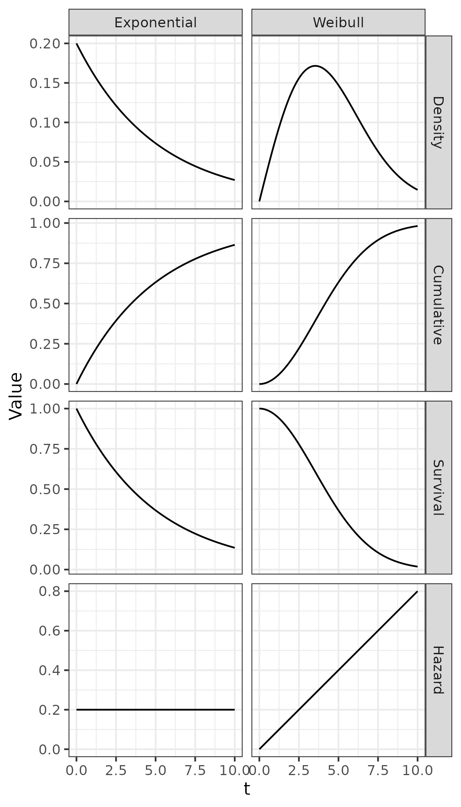
:::
:::

## Parametric time-to-event analysis cont.

::: columns
::: {.column width="70%"}
```{=tex}
\begin{table}
    \centering
    \begin{tabular}{ccc}
        Function & Exponential & Weibull \\
        f(t) & \(\lambda e^{-\lambda t}\) &
\(\lambda\gamma t^{\gamma-1}e^{-\lambda t^{\gamma}}\) \\
        S(t) & \(e^{-\lambda t}\) & \(e^{-\lambda t^\gamma}\) \\
        h(t) & \(\lambda\) & \(\lambda \gamma ^{\gamma - 1}\) \\
    \end{tabular}
\end{table}
```
:::

::: {.column width="30%"}
{height="220"}
:::
:::

## Weibull Regression.

::: columns
::: {.column width="60%"}
1.  Weibull regression works in a linear capacity using the following transformation:
    1.  $F(t) = 1 - exp[(-(t/\lambda)^\gamma)]$
    2.  $ln(t) = ln(\gamma) + (\frac{1}{\lambda})ln(ln(\frac{1}{1-F}))$
    3.  This builds a linear regression $Y=A+BX$ framework:
        1.  Y = $ln(t)$
        2.  X = $ln(ln(1/(1-F)))$
        3.  A = $\ln{\gamma}$
        4.  B = $\frac{1}{\lambda}$
:::

::: {.column width="40%"}

:::
:::

## Background on semi-Markov models

::: columns
::: {.column width="50%"}
1.  Semi-Markov models loosen the *memoryless* assumption of the Markov model and can incorporate a "local clock" which influences the transition intensities across states.
2.  A local clock describes the time a unit has spent in the current state
:::

::: {.column width="50%"}
{height="220"}
:::
:::

## Estimation of a semi-Markov model

Estimating a semi-Markov model requires identifying the transition intensities from one state into another:

Density: $h_{ij}(t) = lim_{\Delta t \rightarrow0}\frac{P(t\leq T < t + \Delta t | T \geq t)}{\Delta t}$

Cumulative: $F_{ij}(t) = \int_{0}^{t} f(u) du = P(T < t)$

Survival: $S_{ij}(t) = 1 - F(t)$

**The semi-Markov model allows for functions outside of the exponential distribution to be used to model transitions across states**

The fully parametric Weibull regression can be used to estimate semi-Markov models

## The similarity of Markov models and survival analysis

1.  Translating between a time-to-event analysis and a semi-Markov can be done with the following equality:

    $h(t)_{ij}=\frac{p_{ij}S_{ij}(t)}{S_{i}(t)}f_{ij}(t)=p_{ij}\frac{f_{ij}(t)}{S_i(t)}$

2.  A multi-state Weibull model can be translated into a semi-Markov model with: $h_{ij}(t)=p_{ij}\frac{\gamma_{ij}}{\lambda_{ij}}(\frac{t}{\lambda_{ij}})^{\gamma_{ij}-1}=\frac{\gamma_{ij}}{p_{ij}^{-1/\gamma_{ij}}\lambda_{ij}}(\frac{t}{p_{ij}^{-1/\gamma_{ij}}\lambda_{ij}})^{\gamma_{ij}-1}$

## Review

1.  Markov models are a commonly applied technique used to study discrete-state time-series data
2.  The Markov assumption however may restrict the utility of the model for behavioral data, it is too restrictive of an assumption to assume that transitions across states are static for the behavioral sciences
3.  A multi-state Weibull regression model can be used to identify hazards that are not static overtime
4.  Additionally the Weibull regression model can incorporate frailty terms, can be used for statistical inference, and can be used to translate findings into semi-Markov models

## Problem statement

1.  Given the popularity of the Markov model, three questions now arise:
    1.  How well does the Markov model perform when the model's assumptions are not met?
    2.  How well does the Markov model perform when population heterogeneity does exist?
    3.  Does the semi-Markov model outperform the Markov model in data that are reflective of psychological studies?

# Simulation

## Motivation

The simulation study was motivated by two questions:

1.  How well does the Markov model perform when data do not adhere to the assumptions of the Markov model?

2.  How well do the fixed effect models perform when there is population heterogeneity & can a random effect mitigate potential heterogeneity concerns?

In order to address these questions a simulation study was performed to examine how well the Markov and the semi-Markov model perform under various simulation characteristics.

## Methods

1,000 data sets were generated by sampling sojourn times from Weibull distributions under varying 8 sampling characteristics, factors were fully crossed yielding a total of 128,000 unique data sets.
The factors included

1.  Sample Size (20 \| 100)

2.  Observation Length (20 \| 40)

3.  Transition Matrix (Stable \| Random)

4.  Weibull Scale Range (.5-5 \| 5-10)

5.  Weibull Shape Parameter (1 \| 3)

6.  **Criterion Variable Magnitude (Null \| Large)**

7.  **Random Effect Variance (0 \| 1)**

8.  **Modeling Strategy**

## Sample Size

Sample size determines the number of unique individuals that provide data.

Larger sample sizes are almost always more desirable and will increase inferential power.

### 


## Observation Length

Longer observation periods provide more information both about an individual's heterogeneity and the sampling characteristics of the true Weibull distribution.

### 


## Transition matrix

A more stable transition matrix provides less information about inter-state transitions, making estimation of true Weibull characteristics more difficult

### 


## Weibull characteristics

A two-parameter Weibull distribution was used to sample sojourn times.
The two-parameter Weibull function is composed of a shape and a scale parameter.

```{r distFuns, fig.height=2, fig.width=4, message=FALSE, warning=FALSE}
library(ggplot2)
cdfWei <- function(time=1, shape=1, scale=1){
  cdfOut <- pweibull(time, shape = shape, scale = scale, lower.tail = TRUE)
  return(cdfOut)
}

survWei <- function(time, shape, scale){
  survOut <- 1 - cdfWei(time, shape, scale)
  return(survOut)
}

hazardWei <- function(time, shape, scale){
  #hazardOut <- shape / scale * (time / scale)^shape - 1
  hazardOut <- -pweibull(q = time, shape = shape, scale = scale, log.p = TRUE, lower.tail = FALSE)
  return(hazardOut)
}

instHazardWei <- function(time, shape, scale){
  ## Take the ratio of hazard & surv function
  outHazardInst <- ifelse(time < 0, 0, shape * (time/scale)^(shape - 1)/scale)
  return(outHazardInst)
}


# Create a data frame with a sequence of x values
## Create all of the shape and scale metrics to sort through
scale.vals <- c(2.5, 5, 2.5, 5)
shape.vals <- c(1, 1, 3, 3)
all.data <- NULL
for(i in 1:4){
  shape_param <- shape.vals[i]
  scale_param <- scale.vals[i]
  data <- data.frame(x = seq(0, 20, length.out = 300))
  data$Density <- dweibull(data$x, shape = shape_param, scale = scale_param)
  data$Cumulative <- cdfWei(time = data$x, shape = shape_param, scale=scale_param)
  data$Survival <- survWei(time = data$x, shape = shape_param, scale=scale_param)
  data$Hazard <- instHazardWei(time = data$x, shape = shape_param, scale = scale_param)
  data$Shape <- shape_param
  data$Scale <- scale_param
  all.data <- dplyr::bind_rows(all.data, data)
}
ggplot(all.data, aes(x=x, y=Density)) +
  geom_line() +
  facet_grid(Shape ~ Scale) +
  xlab("Time") +
  ylab("Density")
```

## Criterion variable magnitude

1.  A population fixed effect variable of interest (criterion variable) will take two either a null effect (0) or a large magnitude effect (0.8)
2.  This variable will take the form of a time- invariant predictor generated from a normal distribution N(0,1)

## Random effect variance

1.  Two levels were selected: none & large random variance
2.  The major motivation is to simulate "stayer" and "movers"

```{r varExamp, fig.height=1, fig.width=4, message=FALSE, warning=FALSE}
library(ggplot2)

set.seed(16)
dat1 <- data.frame(subject = "A", State = rep(c(0,1),each=10), time = 1:20)
dat2 <- data.frame(subject = "B", State = rep(c(0,1),10), time = 1:20)

plot.dat <- dplyr::bind_rows(dat1, dat2)

ggplot(plot.dat, aes(x=time, y=State, group=subject)) +
  geom_point() +
  geom_line() +
  facet_grid(subject ~ .) +
  theme_bw() +
  coord_cartesian(ylim=c(-.05, 1.05)) +
  theme(axis.title = element_blank()) +
  scale_y_continuous(breaks=c(0,1))
```

## Modeling Strategy

1.  Four models were estimated for every simulated dataset
2.  The four models include:
    1.  Continuous-time Markov model (exponential):
    2.  Multilevel continuous-time Markov model (exponential)
    3.  Continuous-time semi-Markov model (Weibull)
    4.  **Multilevel continuous-time semi-Markov model (Weibull)**
3.  Every model included fixed effects for the type of transitions and the criterion variable; the multilevel model included a random intercept term
4.  All models were estimated using a Bayesian framework; naive and diffuse priors were used to estimate every model
    1.  5000 chains; 2000 warmup; thinning of 5; four chains were estimated
    2.  Sampling was performed using the NUTS algorithm implemented in the STAN language [@standevelopmentteamStanModelingLanguage2023]

## Simulation Outcomes

1.  The simulation examined four outcomes:
    1.  Estimation error of the criterion variable
    2.  Estimation error of the shape parameter\*
    3.  Examine criterion variable error specific to shape error\*
    4.  Criterion variable coverage
2.  An ANOVA model was used for outcomes 1 & 2;
3.  An ANCOVA was used for outcome 3
4.  A logistic model was used for outcome 4
5.  **Outcomes 2 & 3 were limited to semi-Markov models**

## Results question 1

1.  Q1 examines the difference between the estimated and true criterion variable

```{=tex}
\begin{table}
    \centering
    \begin{tabular}{cc}
        Parameter & \(\eta^2\) \\
        Magnitude of Random Variance & .29 \\
        Sample Size & .15\\
        Model Strategy & .05 \\
        Sample Size: Magnitude of Random Variance & .10 \\
        Model Strategy: Magnitude of Random Variance & .03 \\
    \end{tabular}
\end{table}
```
## Results question 1

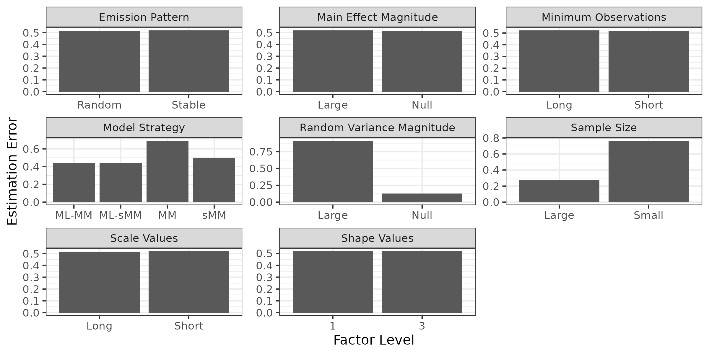

## Results question 1

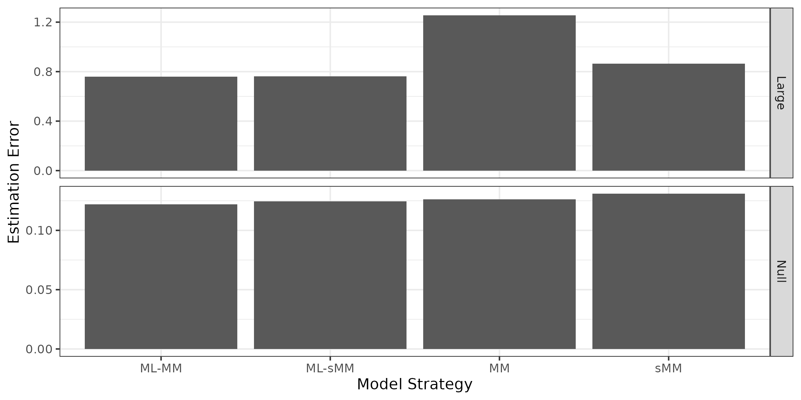

## Results question 2

1.  Q2 examines the difference between the estimated and true shape parameter

```{=tex}
\begin{table}
    \centering
    \begin{tabular}{cc}
        Parameter & \(\eta^2\)\\
        Shape Parameter & .84 \\
        Model Strategy & .07 \\
        Magnitude of Random Variance & .02 \\
        Shape Parameter: Model Strategy & .04 \\
        Magnitude of Random Variance: Model Strategy & .03 \\
    \end{tabular}
\end{table}
```
## Results question 2

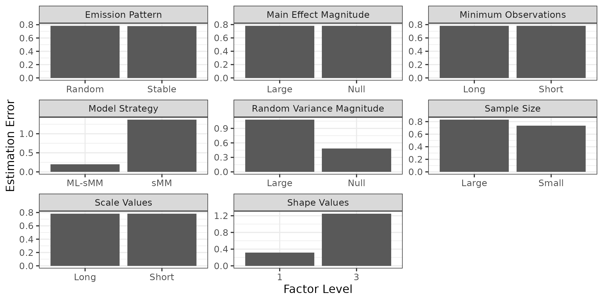

## Results question 2

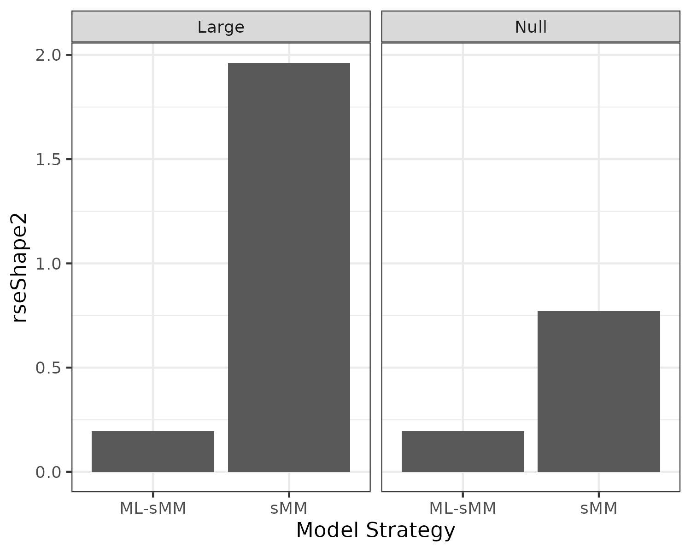{height="260"}

## Results question 3

1.  Q3 examines relationships between shape error and criterion variable error

```{=tex}
\begin{table}
    \centering
    \begin{tabular}{cc}
        Parameter & \(\eta^2\) \\
        Shape Error & .12 \\
        Shape Error:Shape Value & .04 \\
        Shape Error:Sample Size & .02\\
        Shape Error:Model Strategy & .01\\
        Shape Error:Shape Value:Sample Size & .01\\
    \end{tabular}
\end{table}
```
## Results question 3

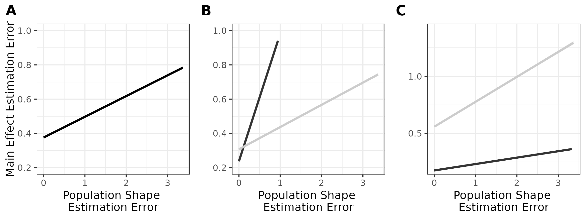

## Results question 4

| Parameters               | Estimate | OR   |
|--------------------------|----------|------|
| Large Sample Size        | 0.70     | 2.01 |
| Long Minimum Observation | -0.26    | 0.77 |
| Random Emission Pattern  | 0.00     | 1.00 |
| Long Scale Values        | 0.01     | 1.01 |
| Weibull Shape Parameter  | -0.20    | 0.81 |
| Large Main Effect        | -1.67    | 0.19 |
| Large Random Variance    | -0.65    | 0.52 |
| ML-sMM                   | 0.56     | 1.75 |
| MM                       | -0.16    | 0.85 |
| ML-MM                    | 0.57     | 1.77 |

## Results question 4

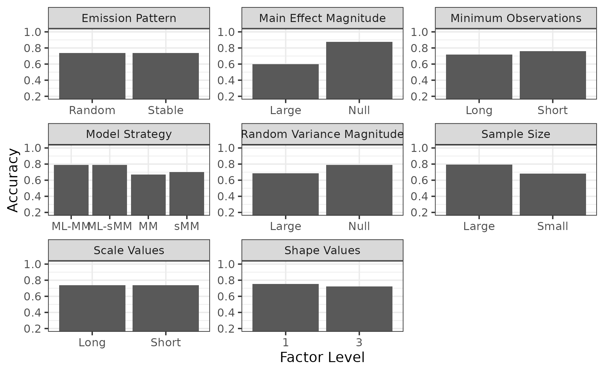

## Results question 4

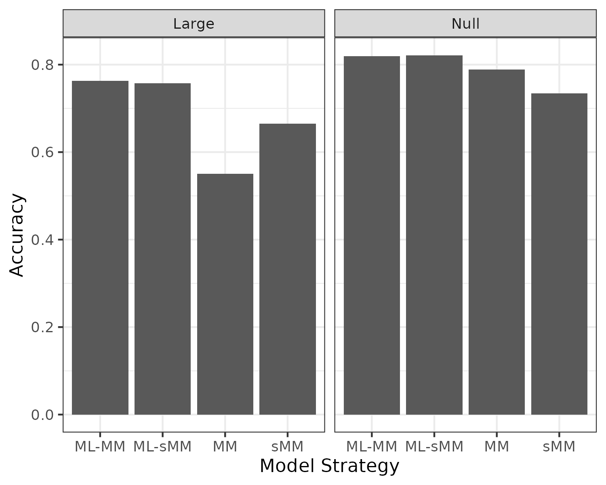{height="250"}

## Simulation summary

1.  This simulation study has showcased the resilience of multilevel semi-Markov models

2.  Question 1 detailed how the multilevel models had lower criterion variable estimation error compared to the fixed effect alternatives; additionally, a two-way interaction displayed how the MM had the greatest error when random variance existed

3.  Question 2 detailed how the multilevel Weibull model performed better at recovering the true shape parameter

4.  Question 3 detailed how mismatch between the estimated shape and the true shape parameter increases criterion variable error

5.  Question 4 detailed how the multilevel models were much better at covering the true location of the criterion variable compared to the fixed effect alternatives

# Empirical

## Introduction

1.  Parent child interaction therapy (PCIT) is a form of therapy that seeks to improve the relationship between a caregiver and their child [@eyberg1988]
2.  It is typically performed in a laboratory setting where a therapist can observe interactions between a caregiver and their child, and the caregiver is receiving instructions from the therapist with a bug in their ear
3.  The underlying motivation is to increase PRIDE and decrease DON'T actions
    1.  PRIDE skills include Behavior descriptions, Praise, Reflection, **Compliable commands**
    2.  [Video example](https://www.youtube.com/watch?v=bldyeAk2InM)
    3.  DON'T skills generally include negative talk and noncompliable commands
4.  A primary motiviation for the development of PCIT was the reduction of externalizing behavior issues

## PCIT

1.  The administration of PCIT follows a protocol where child-directed (CDI) sessions are administered followed by parent-directed sessions (PDI).

    1.  CDI is focused on encouraging PRIDE skills, and providing the caregiver guidance to follow the child's lead in play sessions
    2.  PDI is focused on instructing the parent for how to deliver high quality commands, and when the commands are not complied with, structured disciplinary practices: [Time out example](https://youtu.be/CeVhVTAX9v0?t=219)
    3.  Mastery of CDI is met when parent have displayed more than 10 PRIDE skills during a single play session
    4.  Mastery of PDI is met when the parent delivers effective commands, rewards compliance with praise, and practices administers the timeout procedure when appropriate

2.  The **Dyadic Parent Child Coding System (DPICs)** is one example of a task developed specifically for PCIT [@nelsonDyadicParentChild2018].

## The DPICs design

::: columns
::: {.column width="50%"}
The DPICs is a laboratory administered task which examines the interaction quality between a caregiver-child dyad

caregiver verbal actions are coded into one of three categories during three 5-minute sessions:

1.  Child-led play

2.  Parent-led play

3.  **Clean-up task**

The clean-up task requires the caregiver to instruct the child to put toys back into their boxes without assistance from the caregiver.
:::

::: {.column width="50%"}

:::
:::

## Examining the influence of the child's behavior on caregiver actions

1.  Children’s noncompliance with parental requests represents the most common externalizing problem for which parents seek child mental health services [@owenEffectPraisePositive2012; @kalbChildDisobedienceNoncompliance2003; @chamberlainAntisocialBehaviorChildren2003].
2.  Parents who report greater hostility and elevated child externalizing problems are 35% more likely to engage with their children when noncompliance is observed [@lunkenheimerBreakingCoerciveCycle2016]
3.  Better self-regulation supports parents in refraining from reactive negative parenting [@geeraertsRoleParentalSelfregulation2021]; conversely, poorly regulated parents are more inclined toward harsh and controlling parenting practices and negative affect toward children who generally show more hard-to-manage behavior [@deater-deckardSocioeconomicRiskModerates2012]

## Previous time-series DPICs analyses

1.  The analysis of DPICs data is typically performed by tallying the total number of each verbal expression
    1.  For example CDI mastery is assessed by tallying total number of PRIDE actions
2.  A literature review which examined analyses specific to the DPICs clean-up task revealed two studies similar to the scope of this analysis:
    1.  Somers et al., 2023
    2.  Lunkenheimer et al., 2017

## Somers et al., 2023

1.  In this study researchers examine the interrelations between parent's behaviors and child compliance

2.  A multilevel dynamic factor analysis was used to model relationships between parent's and child's behaviors in 10-second epochs

3.  Parent and child behaviors were coded as binary variables within every epoch

{width="300"}

## Somers et al., cont.


## Somers et al., cont.

"This study suggests that parents’ behavior precipitates the onset of child noncompliance. Yet, specific parental antecedents of child noncompliance differ depending on the context, highlighting ways parents can adjust how they give commands and respond to child behavior that may promote children’s well-regulated, compliant behavior." [@somersAntecedentsConsequencesChild2024]

## Lunkenheimer et al.,

1.  This study examined positive, autonomy supportive behavior coupling related to changes in children’s behavioral responses and coupling related to changes in mother's behavioral responses
2.  Parents and children were coded for affect and goal-directed behavior on a second-by-second basis and codes were mutually exclusive; only the codes for goal-directed behavior were used for the present study.
3.  A continuous-time hidden Markov model was used to examine dynamics across the behaviors

{width="300"}

## Lunkenheimer et al., cont.

1.  This study used transitions into and out of states 1,2, and 4 as the outcome variable, the results suggested:

    1.  For parents who endorse higher levels of harsh parenting, the child was less likely to make use of the mother’s autonomy-supportive parenting practices and transition into autonomous behavior.

    2.  For parents who endorse higher levels of harsh parenting when children displayed positive, autonomous behavior, the mother was less likely to transition into parenting behaviors that supported that autonomy.

## Hypotheses

1.  PCIT will decrease the transition intensities into the DON'T state; and increase transition intensities into the PRIDE state
2.  Child compliance will increase the transition intensity into the PRIDE state after the administration of PCIT

## Methods

1.  Pre- and post-PCIT DPICs data were acquired from 204 parent-child dyads using an intervention versus control RCT design.

2.  The sample was drawn from consecutive family referrals received between April 2016 and June 2019 from the Department of Human Services-Child Welfare and Self-Sufficiency, and who consented to enroll in the study.

| Cohort       | Pre | Post |
|--------------|-----|------|
| Intervention | 115 | 87   |
| Control      | 83  | 63   |

## Methods cont.

1.  Verbal interactions form the parents were coded into one of three categories
    1.  PRIDE: Compliable Commands, Behavior Description, Praise, Reflection
    2.  Neutral: Neutral Talk, Questions
    3.  DON'T: Negative Talk, Non-Compliable Commands

{height="140"}

## Methods cont.

Multilevel Weibull models were estimated to examine timing between transitions (n=23,862), and how pre- and post-PCIT influences these transition intensities

Models took the following form: sojournTime\~(transType+wave+PCIT)\^3

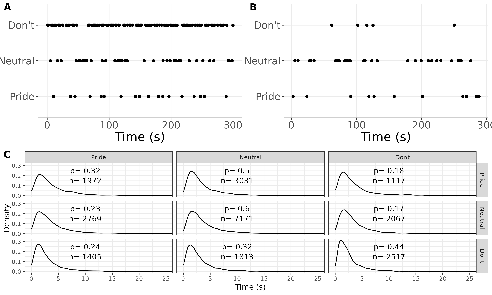{width="240"}

## Methods cont.

The influence of child compliance on parental behaviors was examined in a separate model

This model examined the sojourn times following the delivery of any compliable command

The model takes the following form: sojournTime \~ (nextState+wave+PCIT+compliance)\^4

All models were estimated in a Bayesian framework, 10,000 permutations, 2,000 warm-up, thinning of 10, 6 chains were run, samples were generated using the NUTS algorithm implemented in STAN

## Results

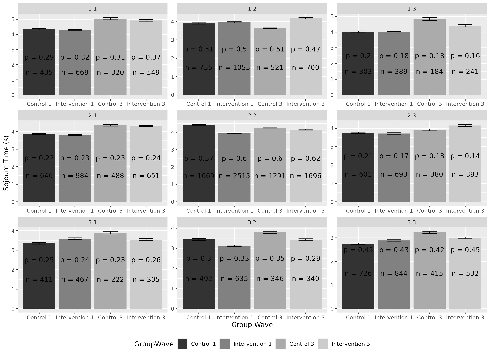{height="270"}

## Results cont.

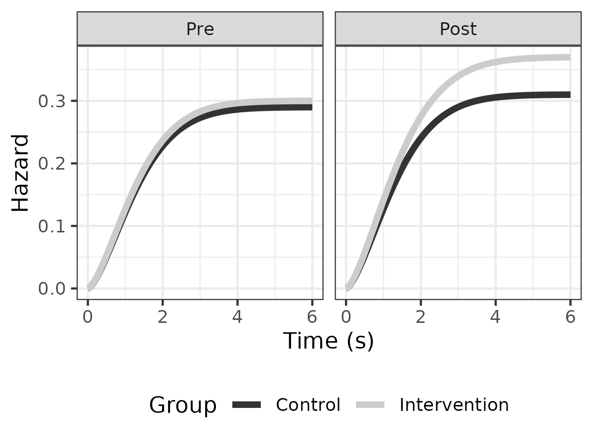{height="300"}

## Results cont.

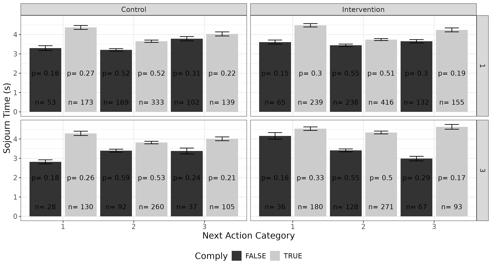{height="300"}

## Results cont.

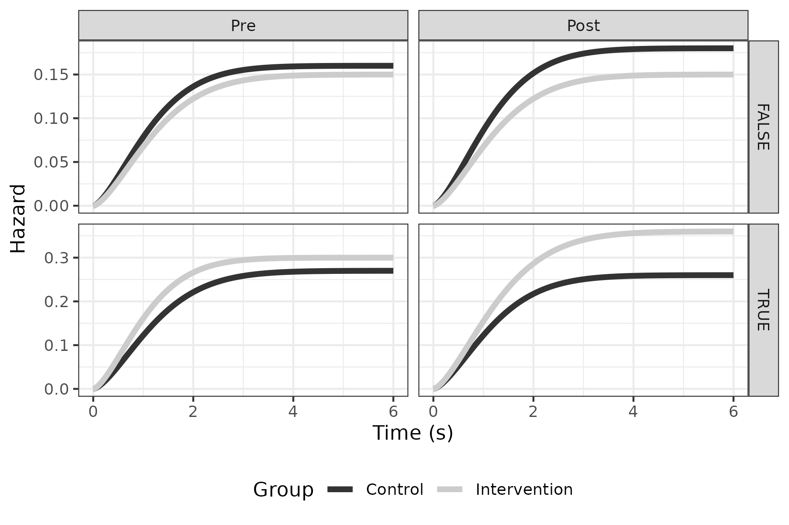{height="300"}

## Empirical Summary

1.  PCIT increased the maintenance of the PRIDE state; participants were more likely to transition from the PRIDE state into the PRIDE after participants were assigned to the intervention cohort; however these transitions occurred slower compared to the pre-PCIT DPICS

2.  PCIT improved PRIDE maintenance a child's compliance; conversely, the control cohort displayed reduced timing for PRIDE behaviors after a child noncompliance

# Conclusions

1.  Semi-Markov models, paramaterized as Multilevel Weibull models, offer an attractive alternative to fixed effect Markov models.
2.  Models that can accommodate population heterogeneity, and non-constant hazards reduce error when estimating criterion variables
3.  The framework proposed here provides a simple alternative to the commonly applied discrete-time Markov models that psychologists readily apply
4.  This framework can be used to identify both time variant and time-invariant influences of behavioral dynamics as displayed in the empirical study performed within this dissertation

## Acknowledgments

::: columns
::: {.column width="50%"}
-   Oklahoma Supercomputing Center for Education & Research (OSCER)

    -   {width="105"}

-   University of Oregon: Elizabeth Skowron Ph.D.

    -   {height="75"}
    -   ***The participants and the data collectors***
:::

::: {.column width="50%"}
-   University of Oklahoma Department of Psychology

    -   Cohort: Coop, Em, Justine, Justin
    -   Quant: Yaqi Li

-   University of Oklahoma Health Sciences Center

    -   Xiaolan Liao Ph.D.

-   **Committee members**

-   **Kailee, Friends, and Family**
:::
:::

## Questions?

### THANK YOU!

## References

```{=tex}
\newcommand\Fontvi{\fontsize{4}{4.2}\selectfont}
\fontsize{3.75}{4.2}\selectfont
```
